## Requirements

```
bokeh >= 1.4.0
numpy >= 1.17.4
plotly >= 4.3.0
scikit-learn >= 0.21.3
```

## Usage

Generate complex synthetic dataset. 

- Data generator functions are in soydata.data
- Visualization functions are in soydata.visualize. These functions uses Bokeh >= 1.4.0 and Plotly >= 4.3.0

```python
from soydata.data import *
from soydata.visualize import *
```

### Two moon

```python
from soydata.data.classification import make_moons
from soydata.visualize import scatterplot

X, labels = make_moons(n_samples=500, xy_ratio=2.0, x_gap=-0.2, y_gap=0.2, noise=0.1)
p = scatterplot(X, labels=labels, height=400, width=400, title='Two moon')
```

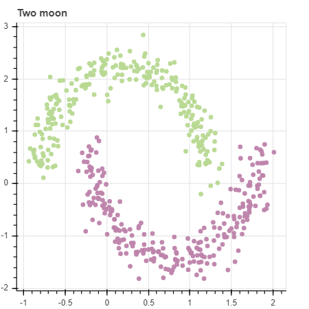

### Spiral

```python
from soydata.data.classification import make_spiral
from soydata.visualize import scatterplot

X, labels = make_spiral(n_samples_per_class=500, n_classes=3,
    n_rotations=2.5, gap_between_spiral=0.1, noise=0.2,
    gap_between_start_point=0.1, equal_interval=True)
p = scatterplot(X, labels=labels, title='Spiral')
```

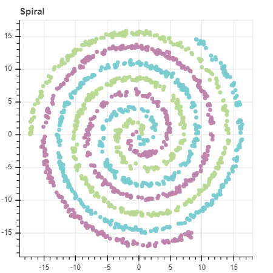

### Swiss roll

```python
from soydata.data.clustering import make_swiss_roll
from soydata.visualize import scatterplot3d

X, colors = make_swiss_roll(n_samples=3000, n_rotations=3, 
    gap=0.5, thickness=0.0, width=10.0, discretize=True)
fig = scatterplot3d(X, colors)
```

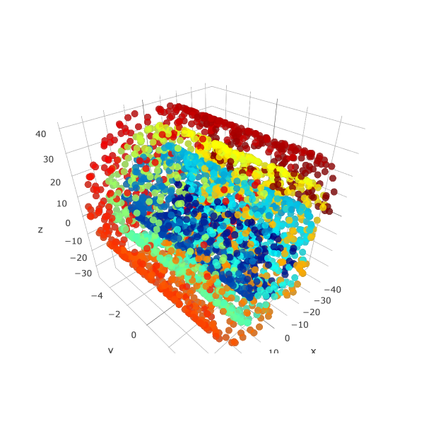

### Radial

```python
from soydata.data import make_radial
from soydata.visualize import scatterplot

X, labels = make_radial(n_samples_per_cluster=100, n_classes=2, 
    n_clusters_per_class=3, gap=0.1, equal_proportion=True,
    radius_min=0.1, radius_scale=1.0, radius_variance=0.5)
p = scatterplot(X, labels=labels, title='Radial')
```

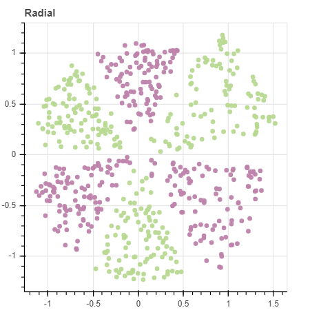

### Two layer radial

```python
from soydata.data.classification import make_two_layer_radial
from soydata.visualize import scatterplot

X, labels = make_two_layer_radial(n_samples_per_cluster=100, n_classes=2, 
    n_clusters_per_class=3, gap=0.0, equal_proportion=True)
p = scatterplot(X, labels=labels, title='Two-layer radial')
```

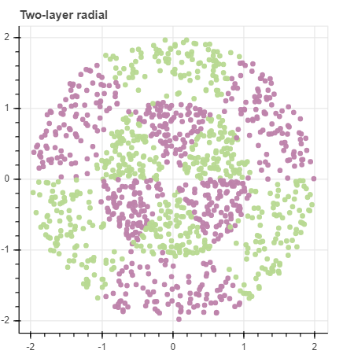

### Rectangular

```python
from soydata.data import make_rectangular
from soydata.visualize import scatterplot

X = make_rectangular(n_samples=500, x_min=0, x_max=10, y_min=0, y_max=10)
p = scatterplot(X, title='Rectangular', size=3)
```

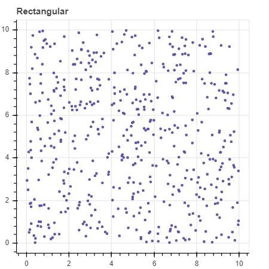

### Triangular

Upper triangular

```python
from soydata.data import make_triangular
from soydata.visualize import scatterplot

X = make_triangular(n_samples=500, upper=True, x_min=0, x_max=10, y_min=0, y_max=10)
p = scatterplot(X, title='Upper triangular', size=3)
```

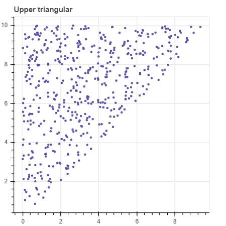

Lower triangular

```python
X = make_triangular(n_samples=500, upper=False, x_min=0, x_max=10, y_min=0, y_max=10)
p = scatterplot(X, title='Lower triangular', size=3)
```

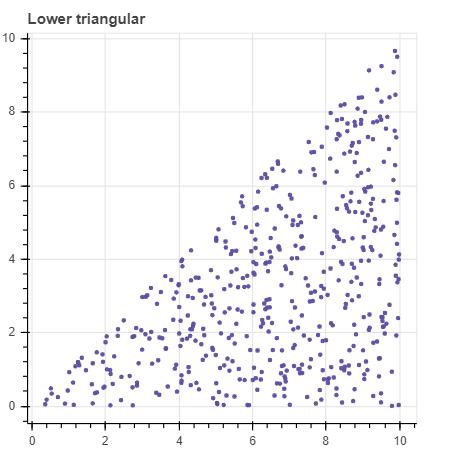

Lower triangular with negative direction

```python
X = make_triangular(n_samples=500, upper=False, positive_direction=False,
    x_min=0, x_max=10, y_min=0, y_max=10)
p = scatterplot(X, title='Lower triangular with negative direction', size=3)
```

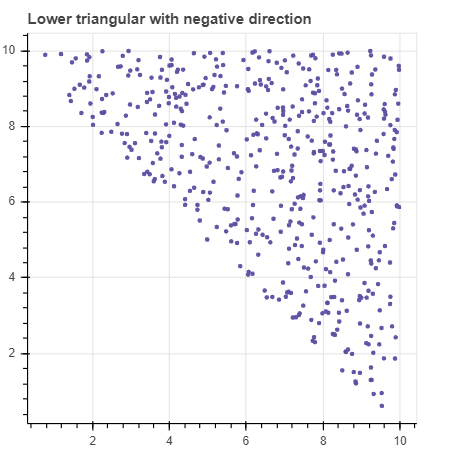

### Decision Tree dataset 1

```python
from soydata.data.classification import make_predefined_data
from soydata.visualize import scatterplot

X, labels = make_predefined_data('decision-tree-1', n_samples=2000)
p = scatterplot(X, labels=labels, size=3, title='decision-tree-1')
```

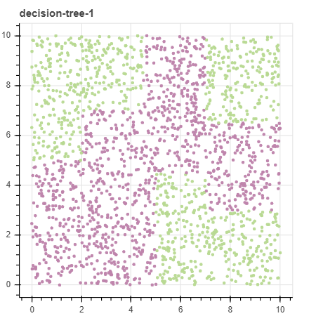

### Decision Tree dataset 2

```python
X, labels = make_predefined_data('decision-tree-2', n_samples=2000)
p = scatterplot(X, labels=labels, size=3, title='decision-tree-2')
```


### Composition of rectangulars

```python
from soydata.data.classification import make_complex_rectangulars
from soydata.visualize import scatterplot

X, labels = make_complex_rectangulars(n_samples=3000, n_classes=3,
    n_rectangulars=20, volume=0.5, seed=0)
p = scatterplot(X, labels=labels, title='Complex rectangulars (3 classes)', size=3)
```

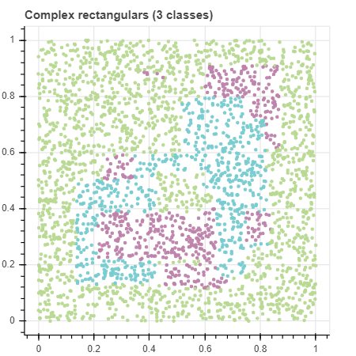

To generate regular patterned data

```python
from soydata.data.classification import make_multilayer_rectangulars
from soydata.visualize import scatterplot

X, labels = make_multilayer_rectangulars(rec_size=100, n_layers=3)
p = scatterplot(X, labels=labels, title='Multilayer rectangulars')
```

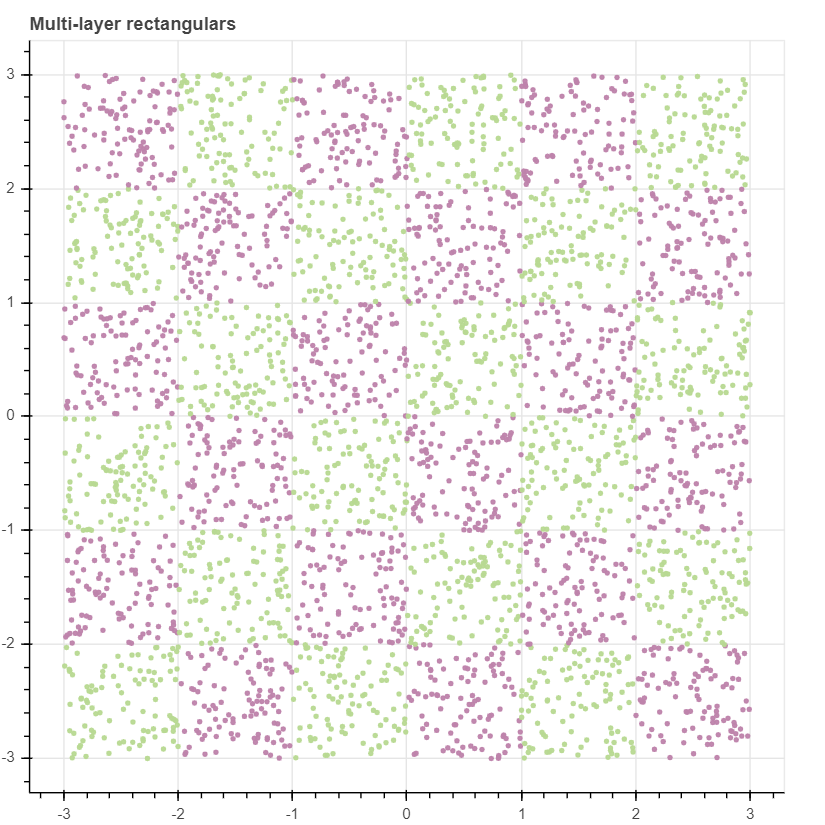

To generate randomly labeled data

```python
from soydata.data.classification import make_multilayer_rectangulars
from soydata.visualize import scatterplot

X, labels = make_multilayer_rectangulars(n_layers=5, random_label=True, n_classes=5)
p = scatterplot(X, labels=labels, title='Random-labeled multilayer rectangulars')
```

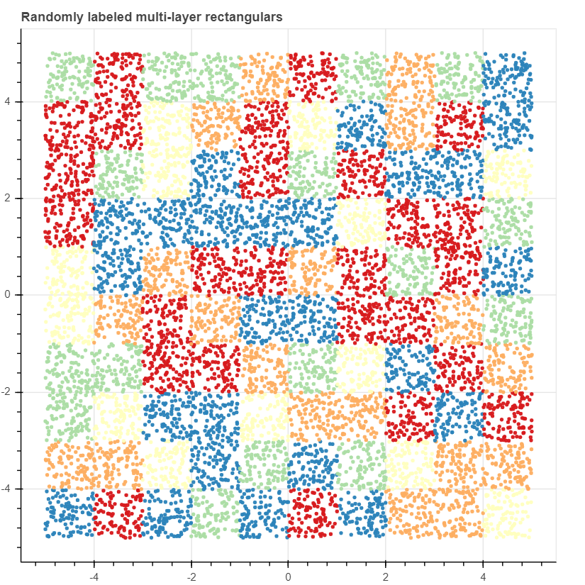

To generate rotated rectangular data

```python
from soydata.data.classification import make_multilayer_rectangulars
from soydata.visualize import scatterplot

X, labels = make_multilayer_rectangulars(n_layers=5, random_label=True, n_classes=5, rotate_radian=np.pi/4)
p = scatterplot(X, labels=labels, title='Randomly labeled multi-layer rectangulars (rotated 45)')
```

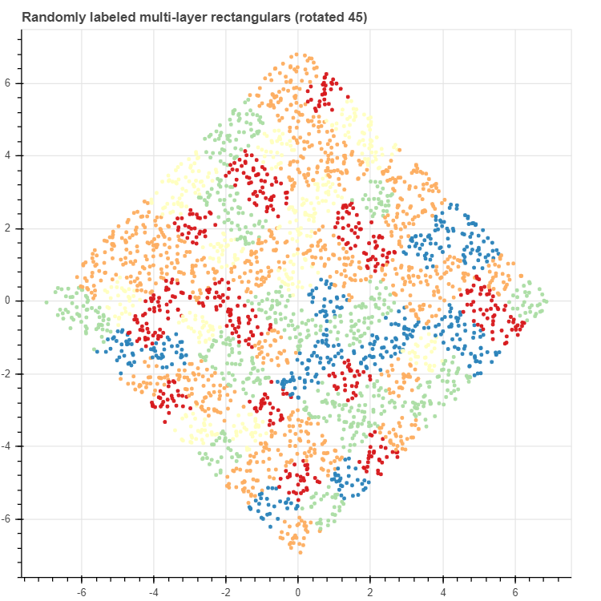

If you want to rotate some other 2D data

```python
import numpy as np
from soydata.data import rotate

X_ = rotate(X, radian=np.pi/4)
```

### Simple clusters

```python
from soydata.data.clustering import make_rectangular_clusters
from soydata.visualize import scatterplot

X, labels = make_rectangular_clusters(n_clusters=8,
    size_min=10, size_max=15, volume=0.2, seed=0)
scatterplot(X, labels=labels, title='Simple clusters')
```

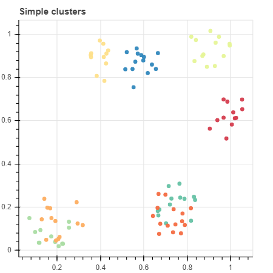

```python
import numpy as np
from soydata.data.clustering.clustering import make_circular_clusters
from soydata.visualize import scatterplot

X, labels = make_circular_clusters(n_clusters=10, r_min=0.05, r_max=0.15,
    equal_density=True, noise=0.05, seed=0)

data_indices = np.where(labels >= 0)[0]
noise_indices = np.where(labels == -1)[0]

p = scatterplot(X[data_indices], labels=labels, size=3, title='Circular clusters',
    show_inline=False, toolbar_location=None)
p = scatterplot(X[noise_indices], p=p, color='lightgrey')
```

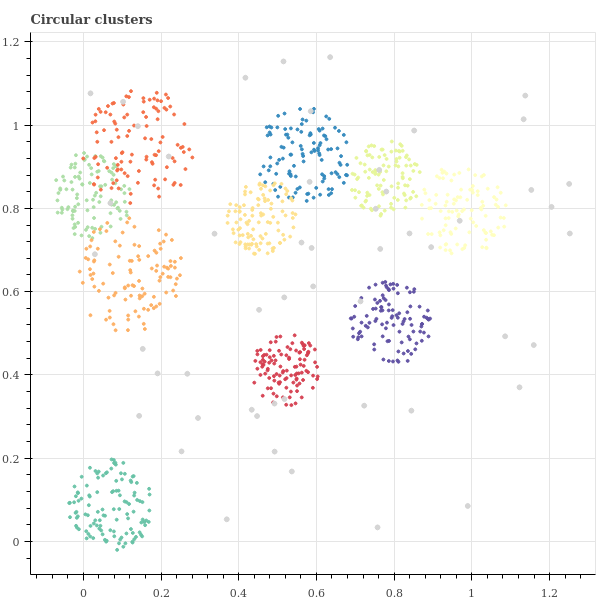

### Linear regression

```python
from soydata.data.regression import make_linear_regression_data
from soydata.visualize import lineplot

x, y, y_true = make_linear_regression_data(n_samples=300, x_range=(-1,1), noise=0.5)
p = lineplot(x, y, show_inline=False, line_width=2, title='linear regression')
# overlay true line
p = lineplot(x, y_true, p=p, line_color='red')
```

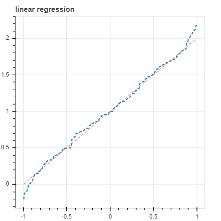

### Polynomial linear regression

```python
from soydata.data.regression import make_polynomial_regression_data
from soydata.visualize import lineplot

x, y, y_true = make_polynomial_regression_data(degree=5, noise=0.2, seed=11, x_range=(-1.5, 1.5))
p = lineplot(x, y, show_inline=False, line_width=2, title='Polynomial regression')
p = lineplot(x, y_true, p=p, line_color='red')
```

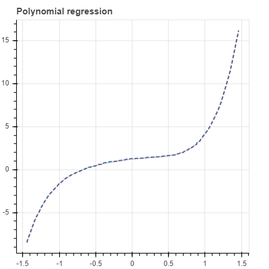

### Randomwalk regression

```python
from soydata.data.regression import make_randomwalk_timeseries_data
from soydata.visualize import scatterplot

x, y, y_true = make_randomwalk_timeseries_data(n_repeats=3, noise=0.1, std=10, seed=0)
p = scatterplot(x, y, size=3, height=200)
```

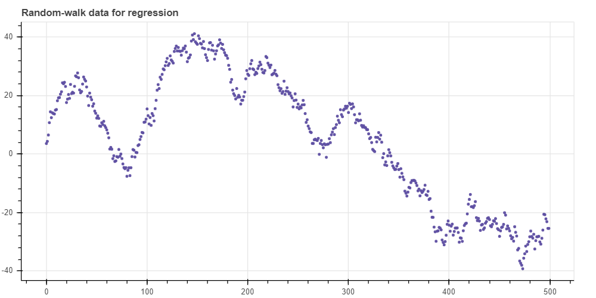

### Stepwise linear regression

```python
from soydata.data.regression import make_stepwise_regression_data
from soydata.visualize import scatterplot

x, y, y_true = make_stepwise_regression_data(n_steps=5, noise=0.1, seed=5)
p = scatterplot(x, y, size=3, height=400, width=800, title='Stepwise regression')
```


### Step function for regression

```python
from soydata.data.regression import make_stepwise_regression_data
from soydata.visualize import scatterplot

x, y, y_true = make_stepwise_regression_data(n_steps=5, noise=0.1, seed=5)
p = scatterplot(x, y, size=3, height=400, width=800, title='Stepwise regression')
```

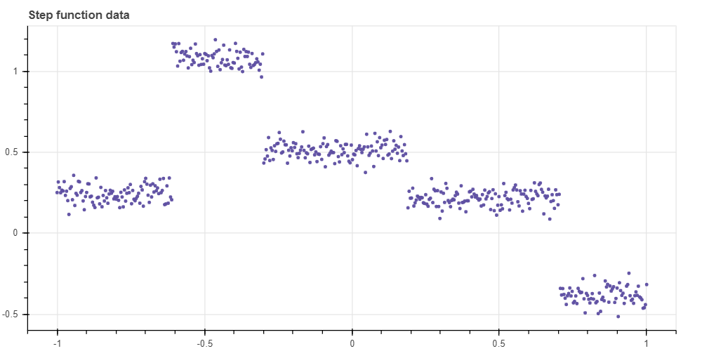
